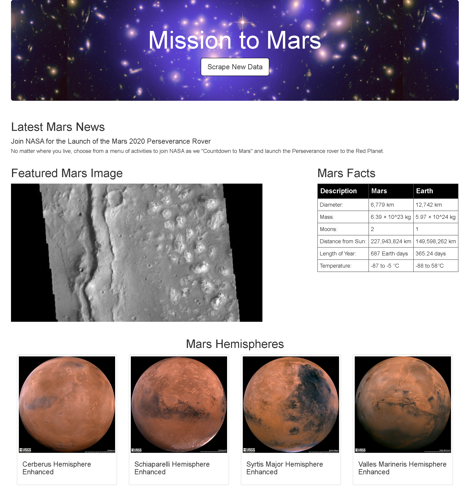

# Web Scraping Homework - Mission to Mars

Scraped various websites for data related to the Mission to Mars and displayed the information in a single HTML page.
- - -
## Scraping

Created a Jupyter Notebook file called `mission_to_mars.ipynb`  to complete scraping and analysis tasks. Initial scraping done using BeautifulSoup, Pandas, and Splinter

### NASA Mars News

Scraped the [Mars News Site](https://redplanetscience.com/) and collected the latest News Title and Paragraph Text and saved these items to variables. 

### JPL Mars Space Images - Featured Image

Visited the url for the Featured Space Image site [here](https://spaceimages-mars.com) and found the image url for the current, full-sized Featured Mars Image and assigned the url string to a variable called `featured_image_url`.

### Mars Facts

Visited the Mars Facts webpage [here](https://galaxyfacts-mars.com) and use Pandas to scrape the table containing facts about the planet.
* Used Pandas to clean the data and convert to a HTML table string.

### Mars Hemispheres

Visited the astrogeology site [here](https://marshemispheres.com/) to obtain high resolution images for each of Mars's hemispheres. 
* Saved  the image url string for the full resolution hemisphere image, and the Hemisphere title containing the hemisphere name. 
* Used a Python dictionary to store the data using the keys `img_url` and `title`. 
* Appended the dictionary with the image url string and the hemisphere title to a list. This list contains one dictionary for each hemisphere.

- - -

## MongoDB and Flask Application

Used  MongoDB with Flask templating to create a new HTML page that displays all of the information that was scraped from the URLs.

* Started by converting the Jupyter notebook into a Python script called `scrape_mars.py` with a function called `scrape` that will execute all of the scraping code and returns one Python dictionary containing all of the scraped data.

* Created a route called `/scrape` that imports the `scrape_mars.py` script and called the `scrape` function.

  * Stored the return value in Mongo as a Python dictionary.

* Created a root route `/` that will query the Mongo database and pass the mars data into an HTML template..

* Created a template HTML file called `index.html` that takes the mars data dictionary and displays all of the data in the appropriate HTML elements. 

